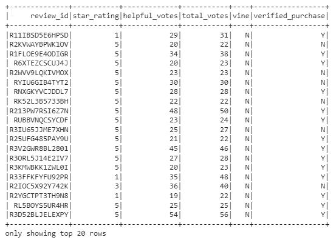
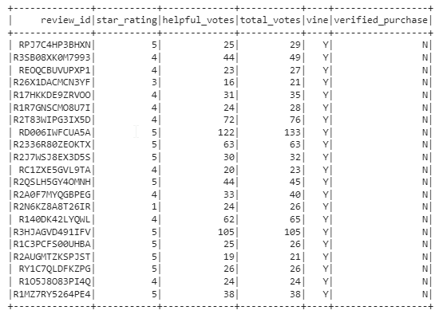
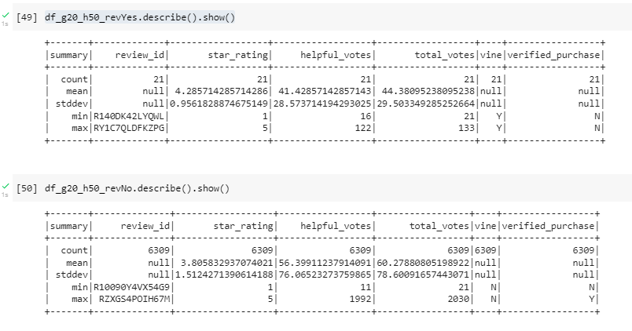

# Module 16: Amazon_Vine_Analysis

The Amazon Vine program is a service that allows manufacturers and publishers to receive reviews for their products. Companies like SellBy pay a small fee to Amazon and provide products to Amazon Vine members, who are then required to publish a review.
## Overview
In this project, we will pick an Amazon dataset and use PySpark to perform the ETL process to extract the dataset, transform the data, connect to an AWS RDS instance, and load the transformed data into pgAdmin.
Next, we will use PySpark, Pandas, or SQL to determine if there is any bias toward favorable reviews from Vine members in your dataset.

## Result
For this analysis, "https://s3.amazonaws.com/amazon-reviews-pds/tsv/amazon_reviews_us_Luggage_v1_00.tsv.gz
" luggage dataset was picked.

The below two Tables show the extracted values. 
Table 1. shows the dataframe for reviews that total votes were more than 20 and the ratio of helpful_votes to total votes  was more than 0.5. These reviews were not paid by Vine. 

**Table 1.**

Table 2. shows the same data filtering expect that these reviews are paid by Vine.

**Table 2.**

Here is the final result:
* There were total of 21 paid reviews
* **47%** of the **paid** reviews were 5 stars.  
 
* There were total of 6309 of unpaid reviews
* **51%** of the **unpaid** reviews were 5 stars.

The calculated percentages are very close and mean that paid values were not biased.

## Summary
In summary, luggage data was used to investigate if there is a bias in paid and unpaid reviews. Based on the calculated values, there is no bias in the ratings.

Additional analysis could be done by looking at average value of the ratings.
In the below figure, the top and bottom rows show the stats for paid and unpaid reviews respectively.
